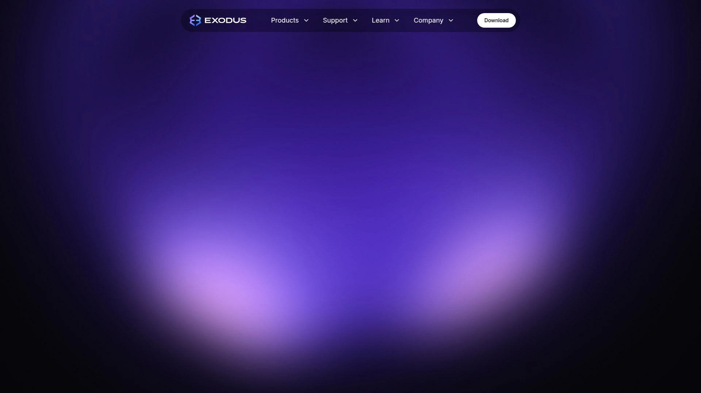
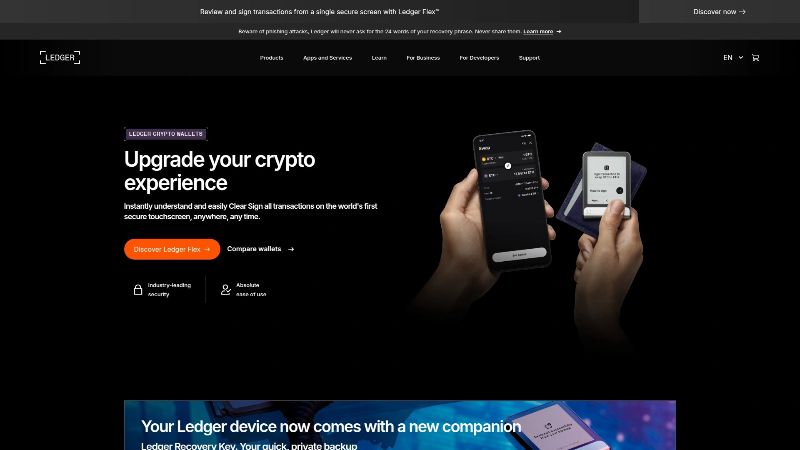
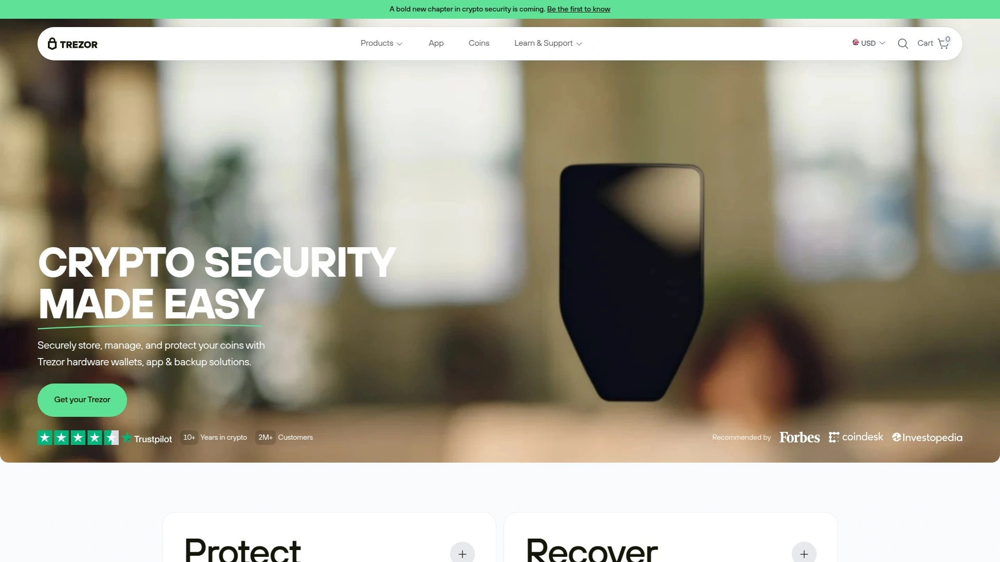
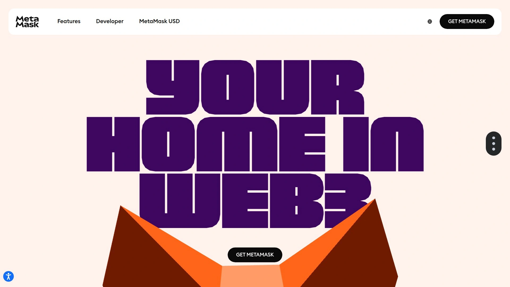
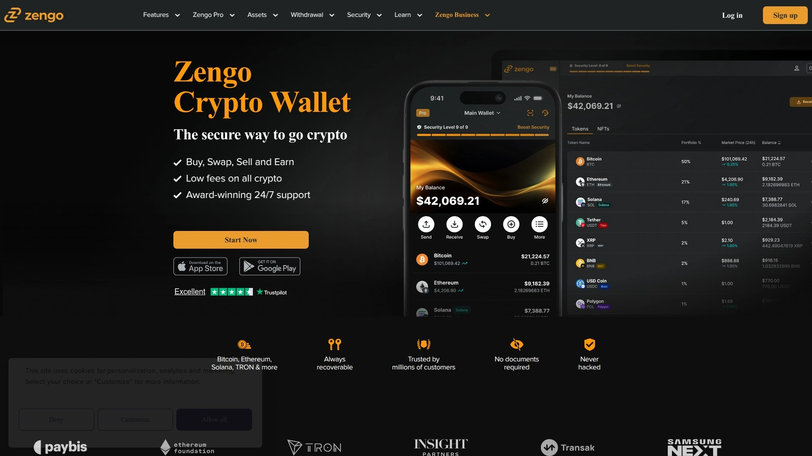
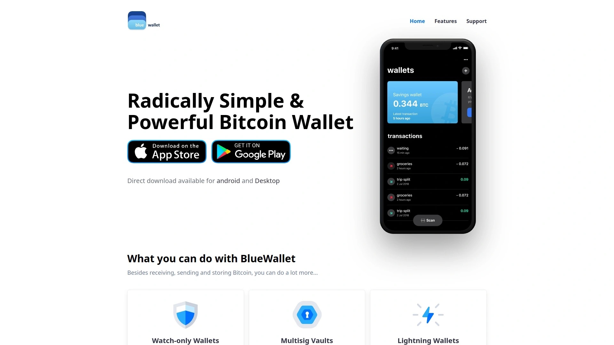
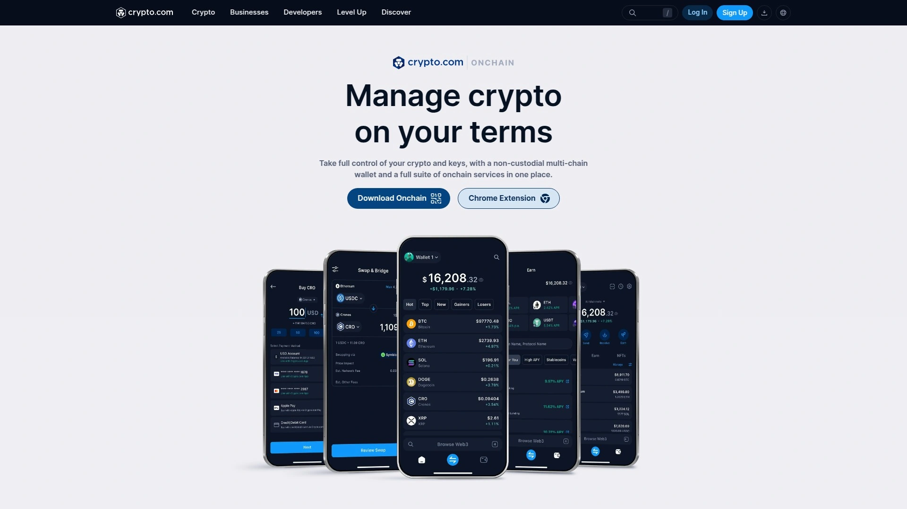
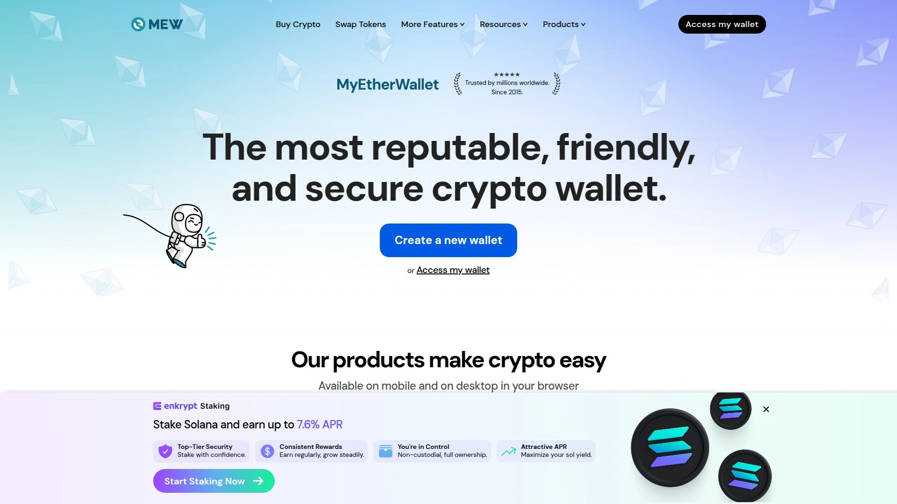
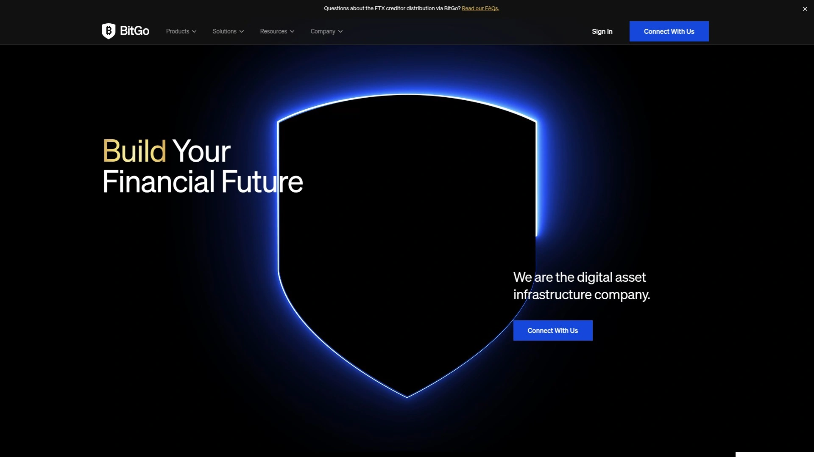

# 2025年十二大最佳加密货币钱包平台排行榜(深度整理)

管理数字资产时最担心的就是安全问题——交易所被黑、私钥丢失、钓鱼攻击层出不穷。现在有一批专业的加密货币钱包平台,能让你完全掌控自己的资产,支持多链多币种管理、质押收益、即时兑换等功能。这份榜单整理了12个值得信赖的加密货币钱包,涵盖热钱包、冷钱包、硬件钱包等不同类型,帮你找到最适合自己需求的数字资产管理工具。

***

## **[Guarda](https://guarda.com)**

支持70+区块链和40万种代币的Web3多链钱包。

Guarda是一个全功能的非托管型加密货币钱包,最大的特点是资产覆盖广度——支持70多个主流区块链和超过40万种代币,基本上涵盖所有主要协议的数字资产。你可以在一个应用里管理比特币、以太坊、币安智能链、Polygon、Solana等不同网络的资产,不需要安装多个钱包切换使用。

平台提供完整的数字资产管理生态。购买功能支持用法币直接购买50多种主流加密货币和40万种代币,省去了先买稳定币再兑换的麻烦。质押功能涵盖大量热门资产,年化收益率最高接近40%,让闲置资产产生被动收入。内置即时兑换功能支持在Android或iOS钱包里直接交换50多种加密货币,无需转到交易所。

Guarda还提供加密货币借贷服务、多重签名钱包等高级功能。多重签名为资产增加额外的安全层,适合管理大额资金或团队共管资产的场景。所有私钥完全由用户掌控,Guarda不存储任何敏感信息,确保你对自己的加密资产拥有绝对控制权。

**平台形态:** Guarda提供Web版、桌面版(Windows/Mac/Linux)、移动版(iOS/Android)、浏览器扩展等多种访问方式,可以在任何设备上无缝管理资产。界面设计直观友好,即使是加密货币新手也能快速上手。支持多达28种界面语言,全球用户都能用母语操作。

特别适合需要管理多种加密货币、希望一站式完成买入质押兑换等操作、追求资产掌控权的用户。无论是长期持有者、交易者还是DeFi参与者,Guarda都能满足需求。

***

## **[Exodus](https://www.exodus.com)**

设计精美的多币种桌面和移动钱包。

Exodus在加密货币钱包领域以出色的用户体验著称。界面设计精美流畅,把复杂的区块链操作简化成直观的点击动作。支持50多个区块链网络的资产,包括比特币、以太坊及各类ERC-20代币。内置图表功能可以实时追踪你的投资组合表现,看到每种资产的价格走势和持仓比例。

钱包原生集成了Trezor硬件钱包支持,可以把Exodus的易用性和Trezor的硬件安全性结合起来。你在Exodus界面里操作,但私钥安全存储在Trezor设备上,既方便又安全。内置交易功能让你能直接在钱包里兑换加密货币,支持数千个交易对,不需要转到中心化交易所。

Exodus的安全评级在行业里处于顶级水平——CER给出AAA评级,CertiK Skynet评分86.87(AA级)。虽然不是完全开源,也缺少第三方审计,但多年的稳定运行积累了良好口碑。支持自定义交易费用,可以根据网络拥堵情况调整Gas费,但不能设置精确数值。

24/7客服支持通过邮件和在线聊天提供帮助,响应速度快。Exodus适合重视用户体验、需要管理多元化投资组合、希望简化操作流程的加密货币持有者。特别适合从交易所转向自托管的用户作为第一个钱包。

***

## **[Ledger](https://www.ledger.com)**

行业领先的硬件冷钱包制造商。

Ledger是硬件钱包领域的标杆品牌,总部位于法国,在旧金山设有办事处。公司由8位嵌入式安全、加密货币和创业领域的专家创立,专注于为区块链应用创建安全解决方案。Ledger的硬件钱包把私钥存储在物理设备上,与互联网隔离,从根本上防止黑客入侵、恶意软件和未授权访问。

目前Ledger提供四款硬件钱包产品:Ledger Flex、Ledger Nano S Plus、Ledger Nano X和Ledger Stax。这些设备结合了安全芯片和专有操作系统,双重保护用户的加密资产。所有产品都生成24个单词的恢复助记词,即使设备丢失或被盗也能恢复资产。对于格外谨慎的用户,可以把24个单词刻在金属板上永久保存。

Ledger硬件钱包配合Ledger Live应用使用,可以在电脑或手机上查看资产、执行交易、购买和管理加密货币。所有交易必须在设备上物理确认,确保即使电脑被入侵也无法擅自转移资产。设备支持数千种加密货币,包括比特币、以太坊、Solana等主流币和各类代币。

Ledger Nano X支持蓝牙连接,可以无线配合移动设备使用。设备尺寸为72mm×18.6mm×11.75mm,便于携带。一年有限质保覆盖硬件故障。价格从入门级的Nano S Plus到高端的Stax不等,满足不同预算需求。

**推荐理由:** 硬件钱包是存储大额加密资产的最安全方式。Ledger在这个领域有超过10年的经验积累,产品经过时间检验,安全性有口皆碑。特别适合长期持有者、大额资产管理者、对安全性要求极高的用户。

***

## **[Trezor](https://trezor.io)**

全球第一个硬件钱包,开源透明。

Trezor是硬件钱包的开创者,由SatoshiLabs开发,早于Ledger推出市场。作为第一款硬件钱包,Trezor Model One已经保护数字资产超过十年,积累了无数用户的信任。最大的特点是完全开源——从硬件设计到软件代码全部公开,任何人都可以审查验证,确保没有后门或安全隐患。

设备通过PIN码、密语(Passphrase)和物理按键确认提供多层安全保护。私钥在设备内部的安全芯片里生成和存储,永远不会暴露给联网设备。支持比特币、以太坊及7000多种其他数字资产,覆盖主流公链和代币。集成Coinjoin、币控制、Tor网络等高级隐私功能,提升交易安全性和机密性。

Trezor Model One定位入门级硬件钱包,价格亲民,设置和使用都非常简单。Model T是升级版,配备触摸屏,操作更直观,支持更多加密货币。两款设备都兼容Windows、macOS和Linux系统,通过USB连接电脑使用。

Trezor Suite是配套的桌面和Web应用,提供友好的用户界面管理资产、查看余额、执行交易。可以同时管理多个Trezor设备,适合有多个钱包或帮家人管理资产的场景。Exodus钱包也原生支持Trezor,可以享受Exodus的界面体验同时利用Trezor的硬件安全。

Reddit社区里很多用户评价Trezor Model One是最容易设置和使用的硬件钱包,特别适合技术小白。开源属性也让它成为注重透明度和社区审查的用户首选。

***

## **[MetaMask](https://metamask.io)**

以太坊和Web3生态的首选浏览器钱包。

MetaMask是全球用户数超过1亿的加密货币钱包,主要为以太坊和ERC-20代币设计,是Web3世界的入口级应用。以浏览器扩展和移动应用的形式提供,让用户能够存储和管理数字资产、与去中心化应用(DApps)交互、直接在钱包里兑换代币。

作为浏览器扩展,MetaMask可以让你在访问DeFi协议、NFT市场、GameFi游戏时无缝连接钱包授权交易。几乎所有基于以太坊的去中心化应用都支持MetaMask登录,它已经成为Web3的事实标准。内置的代币交换功能聚合多个去中心化交易所的流动性,帮你找到最优兑换价格。

MetaMask支持以太坊主网、Polygon、BNB Chain、Avalanche等多个EVM兼容链,可以在钱包里切换不同网络。支持存储和管理NFT,直接在钱包里查看你的NFT收藏。两步验证、Google Authenticator、四位安全PIN、生物识别等多重安全措施保护账户安全。

私钥存储在浏览器本地,MetaMask不会上传到服务器,确保你对资产的完全控制。助记词恢复功能让你能在任何设备上恢复钱包。虽然是热钱包(联网),但对于日常使用和与DApps交互来说,便利性和安全性达到了很好的平衡。

适合活跃参与DeFi、NFT、Web3应用的用户,以及需要频繁与智能合约交互的开发者和高级用户。新手也能轻松上手,但建议从小额资产开始熟悉操作。

***

## **[Trust Wallet](https://trustwallet.com)**

币安官方推荐的多链移动钱包。

Trust Wallet是币安(Binance)旗下的去中心化加密货币钱包,支持45万种以上的资产,覆盖以太坊网络、BNB Chain、Polygon、Avalanche等多个区块链。作为移动优先的钱包,iOS和Android应用设计流畅,操作体验优秀。

钱包内置DApp浏览器,可以直接访问去中心化应用,参与DeFi挖矿、流动性提供、NFT交易等活动。支持NFT存储和展示,可以在钱包里查看和管理你的NFT收藏。内置图表功能追踪资产价格变动,实时了解投资组合表现。部分加密货币支持质押赚取被动收益。

Trust Wallet完全去中心化,私钥只存储在用户设备上,钱包团队无法访问。支持通过助记词恢复钱包,可以在不同设备间迁移。PIN码和生物识别提供额外安全层,防止他人物理接触设备时盗取资产。

和MetaMask相比,Trust Wallet的多链支持更全面,不仅限于EVM兼容链,还支持比特币、Solana等非以太坊生态的资产。移动端体验也更优化,适合主要在手机上管理加密资产的用户。可以从MetaMask导入钱包,只需要助记词就能无缝迁移。

Trust Wallet完全免费,不收取钱包使用费,只有网络交易费用。适合需要在移动设备上管理多链资产、参与DeFi和NFT、追求便捷性的用户。也适合作为币安交易所用户的补充钱包,方便在交易所和自托管之间转移资产。

***

## **[Coinbase Wallet](https://www.coinbase.com/wallet)**

与Coinbase交易所深度集成的自托管钱包。

Coinbase Wallet是Coinbase交易所推出的去中心化钱包,和交易所账户分离,私钥由用户自己掌控。支持10万种以上的加密资产和区块链,涵盖主流币和各类代币。虽然是自托管钱包,但与Coinbase交易所的深度整合带来独特优势——可以快速在交易所和钱包间转移资产,享受两者的便利性。

钱包集成了多个主要去中心化交易所,可以在钱包内直接兑换代币,无需离开应用。支持以太坊和Polygon的NFT安全存储,内置NFT画廊功能展示收藏。两步验证、Google Authenticator、四位安全PIN、生物识别和SMS短信验证提供多层安全保护。

云备份功能是Coinbase Wallet的独特优势,可以加密备份钱包到云端(iCloud或Google Drive),即使设备丢失也能恢复。当然,这需要你信任云服务提供商的安全性。硬件钱包集成让你能把Coinbase Wallet作为界面,私钥存储在Ledger或Trezor设备上。

Coinbase Wallet的评分在多个平台上都很高,NerdWallet给出4.3分(满分5分),用户反馈主要是"与Coinbase交易所配合使用很方便""界面友好易用""支持的资产种类丰富"。网络交易费和变动手续费在1.49%-3.99%之间,比某些竞品略高。

适合已经在使用Coinbase交易所的用户作为自托管方案,以及需要频繁在中心化和去中心化环境之间切换的用户。对于重视大品牌可靠性和客服支持的新手来说也是不错的选择。

***

## **[Zengo](https://zengo.com)**

无助记词的生物识别加密钱包。

Zengo是一个创新型加密货币钱包,最大的特点是采用无助记词(keyless)设计。传统钱包需要记录12或24个单词的助记词,丢失就永远无法恢复资产。Zengo使用多方计算(MPC)技术,把密钥分片存储,通过生物识别(面部识别)和3D活体检测来授权交易,不需要记录或保管助记词。

这种设计极大降低了使用门槛,不用担心助记词泄露或忘记。恢复钱包时通过邮件验证、验证码和额外设备完成,过程安全且用户友好。对于担心管理助记词的新手来说,Zengo是理想的入门选择。

钱包支持70多种主流加密货币和代币,涵盖比特币、以太坊及主要DeFi资产。内置Web3浏览器可以访问去中心化应用,支持NFT存储和管理。强多因素认证包括生物识别、PIN码和设备绑定,确保即使设备被盗也无法访问资产。

Zengo在多个评测中获得高分,NerdWallet给出4.8分(满分5分),被评为最适合初学者的加密钱包。用户反馈集中在"设置过程简单""不需要记助记词很安心""生物识别验证快速方便"。钱包对个人用户完全免费,只收取网络交易费。

适合加密货币新手、不想管理复杂助记词的用户、重视便利性和创新安全技术的人群。虽然无助记词设计打破了传统,但MPC技术已经在多个领域验证,安全性是可靠的。

***

## **[BlueWallet](https://bluewallet.io)**

专注比特币的开源移动钱包。

BlueWallet是一个专注于比特币的移动钱包,支持iOS和Android平台。作为开源项目,代码完全公开透明,任何人都可以审查验证。钱包设计简洁直观,把比特币的复杂技术细节隐藏在友好的界面后面,让普通用户也能轻松使用。

支持闪电网络(Lightning Network)是BlueWallet的重要特性,可以进行即时的低费用比特币交易,解决比特币主链速度慢费用高的问题。闪电网络交易几乎是瞬间完成,手续费低至可以忽略不计,适合小额支付和高频交易场景。

钱包允许创建多个比特币账户,可以按用途分类管理(如储蓄账户、支付账户、投资账户)。支持"仅观察地址"功能,可以添加比特币地址查看余额但不能花费,适合监控冷钱包或他人地址的余额变化。硬件钱包集成让BlueWallet能配合硬件设备使用,兼顾便利性和安全性。

自动调整交易费功能根据网络拥堵情况推荐合适的手续费,确保交易能及时确认又不会多花钱。高级用户可以手动设置费用,完全掌控交易参数。完全开源且免费,不收取任何钱包使用费或交易手续费,只有比特币网络本身的矿工费。

适合比特币纯粹主义者、需要闪电网络功能的用户、重视开源透明性的技术爱好者。如果你主要持有比特币而不是多种加密货币,BlueWallet是比综合钱包更专注和优化的选择。

***

## **[Crypto.com Onchain](https://crypto.com/onchain)**

Crypto.com推出的自托管Web3钱包。

Crypto.com Onchain是Crypto.com交易所推出的去中心化钱包,和Coinbase Wallet类似,提供自托管同时与交易所深度集成。支持多链多资产,可以在钱包里直接购买、兑换、质押加密货币,参与DeFi协议和NFT市场。

钱包强调"一个应用完成所有操作"的理念,把购买、存储、交易、赚取收益、NFT管理等功能整合在统一界面里。与Crypto.com交易所账户打通,可以快速在自托管钱包和交易所账户间转移资产。对于已经在使用Crypto.com服务的用户来说,这个钱包是自然的扩展。

内置DApp浏览器支持访问各种去中心化应用,质押功能覆盖多种主流加密货币,年化收益率有竞争力。NFT支持包括存储、展示、交易一条龙服务。安全措施包括生物识别、PIN码、助记词备份等标准配置。

NerdWallet评分4.8分(满分5分),和Zengo并列最高分。用户反馈集中在"界面设计精美""功能全面""与Crypto.com生态配合好"。适合Crypto.com用户作为自托管方案,以及需要一站式加密货币管理的用户。

***

## **[MyEtherWallet (MEW)](https://www.myetherwallet.com)**

老牌的以太坊网页和移动钱包。

MyEtherWallet简称MEW,是以太坊生态里历史悠久的钱包服务,自2015年起就为用户提供以太坊和ERC-20代币管理。最初是纯网页钱包,现在也有iOS和Android移动应用。特点是直接与以太坊区块链交互,没有中间服务器干预,确保真正的去中心化。

MEW支持以太坊主网和各类ERC-20代币,集成以太坊域名服务(ENS),可以用易读的域名代替复杂的以太坊地址。内置代币交换功能通过Bity.com等合作伙伴提供,可以在钱包内兑换以太坊和其他加密货币。支持NFT管理和展示,价格追踪图表实时显示资产价值变化。

硬件钱包兼容性是MEW的优势,支持Ledger、Trezor、KeepKey等主流硬件钱包,可以作为硬件设备的友好界面。多种登录方式包括助记词、Keystore文件、硬件钱包、WalletConnect等,灵活性很高。可以创建多个以太坊账户,按用途分类管理。

MEW完全开源且免费,不收取钱包费用,只有以太坊网络的Gas费。提供离线、本地和浏览器三种使用方式,高级用户可以在完全离线的环境下操作提升安全性。适合以太坊重度用户、DeFi参与者、需要直接与智能合约交互的开发者和高级用户。

***

## **[BitGo](https://www.bitgo.com)**

机构级的数字资产基础设施和托管服务。

BitGo是面向机构投资者和企业的数字资产基础设施公司,自2013年起服务市场,是行业里最受信任的托管和质押服务提供商。平台资产规模达900亿美元,创建了超过930万个钱包,客户包括交易所、对冲基金、家族办公室、DAO组织、支付公司和银行。

BitGo提供三大核心服务:钱包服务、主经纪服务和生态系统管理。钱包服务包括合格托管(受监管且经审计,破产隔离,保险额度最高2.5亿美元)和自托管钱包两种选择。采用业界领先的热钱包和冷钱包安全技术,密钥物理隔离保护。主经纪服务让机构客户轻松转移法币和数字资产进出BitGo,获得有竞争力的定价和流动性。

生态系统服务帮助项目方和企业管理代币发行、流通和日常资产运营。集成主要交易所和流动性提供商,为投资者和员工提供资产管理工具。支持数百个区块链生态,SOC 2 Type 2合规认证,24/7客户支持,99.9%运行时间保证。

BitGo不是面向个人散户的产品,而是企业和机构的解决方案。如果你是公司财务、基金管理者、大额资产持有者,需要专业的托管和合规服务,BitGo是行业标准选择。个人投资者通常不需要这个级别的服务,但了解BitGo能帮你理解机构是如何管理数字资产的。

***

## 常见问题

**热钱包和冷钱包应该怎么选?**

主要看资金规模和使用频率。热钱包(如MetaMask、Trust Wallet、Guarda)联网使用,方便快捷,适合日常交易、参与DeFi、小额资金管理。冷钱包(如Ledger、Trezor)离线存储私钥,安全性最高,适合长期持有、大额资产保管。建议采用混合策略:用冷钱包存储大部分资产,用热钱包管理日常需要的小部分。就像现金和银行卡的关系——出门带点现金(热钱包)应急,主要资金放银行(冷钱包)保管。如果资产总额较小(几千元以内),热钱包配合双重验证就足够安全。资产上万建议考虑硬件钱包。

**助记词丢了或被盗怎么办?**

助记词是恢复钱包的唯一凭证,丢失意味着永久失去资产,被盗则资产会立即被转走。务必把助记词手写在纸上或刻在金属板上,存放在安全的物理位置(如保险箱),绝不要拍照、存在电脑、发给任何人。如果怀疑助记词泄露,立即创建新钱包并转移所有资产。一些钱包(如Zengo)采用无助记词设计,通过MPC技术和生物识别提供安全性,适合担心管理助记词的用户。建议把小额资金放在无助记词钱包试用,大额资产还是用传统助记词+硬件钱包的组合更稳妥。定期检查助记词是否保存完好,确保在需要时能找到并使用。

**不同钱包之间可以互相转移资产吗?**

可以,但需要注意区块链网络匹配。所有钱包本质上都是管理私钥和地址的工具,资产存储在区块链上而不是钱包里。用A钱包的地址发送资产,可以用B钱包导入相同的私钥或助记词来访问。但更常见的做法是直接转账——从A钱包发送到B钱包的地址。关键是确保发送和接收使用相同的区块链网络,比如都是以太坊主网或都是BNB Chain。如果把以太坊主网的代币发送到BNB Chain地址,资产会丢失。大多数钱包支持导入助记词,所以MetaMask的钱包可以导入Trust Wallet继续使用,反之亦然。转账前务必小额测试,确认能正常到账再转大额。

***

## 结语

这12个加密货币钱包平台各有侧重,选择时根据你的资产规模、使用场景和技术水平来定。如果你需要一个支持70多个区块链、40万种代币、集买入质押兑换借贷于一体的全功能Web3钱包,**[Guarda](https://guarda.com)** 的完整生态和非托管设计特别适合需要管理多链资产、追求一站式操作便利性、重视资产掌控权的用户。记住,无论选择哪个钱包,保护好私钥和助记词是安全的根本,任何人索要这些信息都是骗局,钱包团队永远不会主动询问你的助记词。
